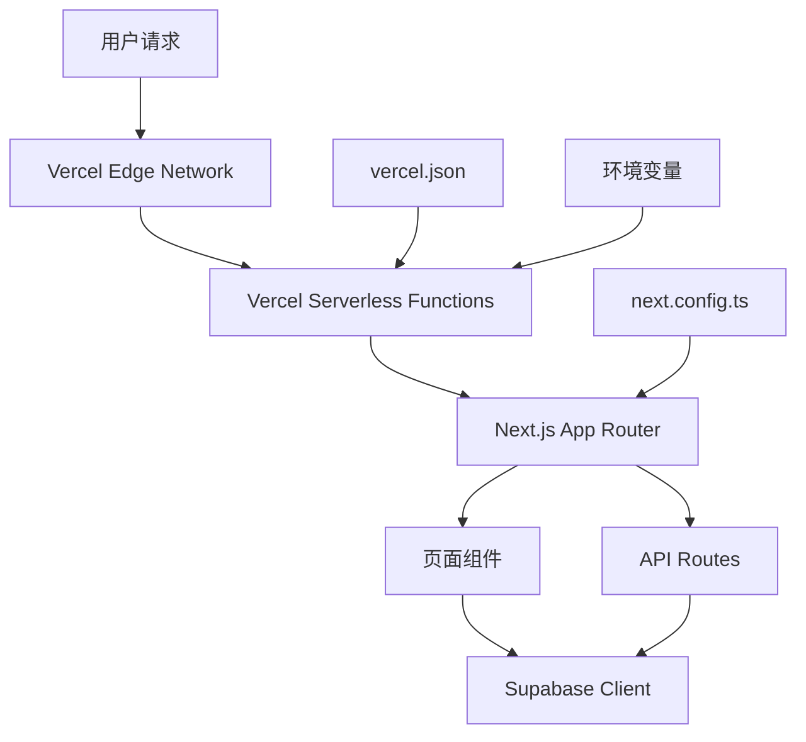

# Design Document: Vercel 部署修复

## Overview

本设计文档提供了修复 Next.js 项目在 Vercel 上部署 404 问题的完整技术方案。通过分析当前项目结构和 Vercel 部署要求，我们将实施一系列配置优化和修复措施，确保应用在生产环境中正常运行。

## Architecture

### 部署架构图



### 核心组件关系

1. **Vercel 配置层**: vercel.json 定义部署行为和路由规则
2. **Next.js 配置层**: next.config.ts 控制构建和运行时行为  
3. **应用路由层**: App Router 处理页面和 API 路由
4. **组件渲染层**: React 组件和服务端渲染

## Components and Interfaces

### 1. Vercel 配置组件

**vercel.json 配置文件**
- 定义构建命令和输出目录
- 配置路由重写规则
- 设置环境变量和函数配置
- 处理静态文件服务

**接口规范:**
```json
{
  "buildCommand": "npm run build",
  "outputDirectory": ".next",
  "framework": "nextjs",
  "rewrites": [...],
  "functions": {...}
}
```

### 2. Next.js 配置组件

**next.config.ts 优化**
- 确保与 Vercel serverless 兼容
- 配置正确的输出模式
- 处理静态资源和图片优化
- 设置路径别名解析

**接口规范:**
```typescript
interface NextConfig {
  output?: 'standalone' | 'export';
  images: ImageConfig;
  experimental?: ExperimentalConfig;
}
```

### 3. 路由处理组件

**App Router 结构验证**
- 确保所有页面文件正确命名
- 验证布局文件层次结构
- 检查动态路由参数处理
- 确认 API 路由端点配置

### 4. 环境配置组件

**环境变量管理**
- 区分开发和生产环境配置
- 确保 Supabase 连接参数正确
- 处理敏感信息的安全存储
- 验证必需变量的存在性

## Data Models

### 配置数据模型

```typescript
interface DeploymentConfig {
  vercelConfig: {
    buildCommand: string;
    outputDirectory: string;
    framework: string;
    rewrites?: RewriteRule[];
    functions?: FunctionConfig;
  };
  
  nextConfig: {
    output?: OutputMode;
    images: ImageConfig;
    experimental?: Record<string, any>;
  };
  
  environmentVariables: {
    [key: string]: string;
  };
}

interface RewriteRule {
  source: string;
  destination: string;
}

interface FunctionConfig {
  [path: string]: {
    runtime?: string;
    memory?: number;
    maxDuration?: number;
  };
}
```

### 路由数据模型

```typescript
interface RouteStructure {
  pages: PageRoute[];
  apiRoutes: ApiRoute[];
  layouts: LayoutFile[];
}

interface PageRoute {
  path: string;
  filePath: string;
  dynamic: boolean;
  params?: string[];
}

interface ApiRoute {
  endpoint: string;
  filePath: string;
  methods: HttpMethod[];
}
```

## Correctness Properties

*A property is a characteristic or behavior that should hold true across all valid executions of a system-essentially, a formal statement about what the system should do. Properties serve as the bridge between human-readable specifications and machine-verifiable correctness guarantees.*

### Property Reflection

After analyzing the acceptance criteria, I identified several properties that can be consolidated:
- Properties about route handling (2.3, 2.4) can be combined into a comprehensive route validation property
- Properties about build output (3.1, 3.2) can be combined into a build completeness property  
- Properties about page rendering (5.2, 5.3) can be combined into a comprehensive rendering property
- Environment variable and service initialization properties (4.1, 4.3) can be combined

### Correctness Properties

Property 1: Build output completeness
*For any* Next.js build execution, the build output should contain all necessary static assets, SSR files, and route definitions required for deployment
**Validates: Requirements 1.3, 3.1, 3.2**

Property 2: Route handling completeness  
*For any* defined route in the application (pages, API endpoints, dynamic routes), the deployed application should correctly handle requests to that route and return appropriate responses
**Validates: Requirements 2.3, 2.4**

Property 3: Path alias resolution
*For any* import statement using the @/* path alias, the build system should correctly resolve the import to the actual file path
**Validates: Requirements 3.4**

Property 4: Environment configuration access
*For any* required environment variable, the deployed application should be able to access and use that variable correctly
**Validates: Requirements 4.1, 4.3**

Property 5: Page rendering consistency
*For any* page component in the application, it should render correctly in the production environment with proper client-side navigation functionality
**Validates: Requirements 5.2, 5.3**

## Error Handling

### 部署错误处理策略

1. **构建失败处理**
   - 提供详细的构建错误日志
   - 自动回滚到上一个成功版本
   - 发送构建失败通知

2. **运行时错误处理**
   - 实现全局错误边界
   - 记录客户端和服务端错误
   - 提供用户友好的错误页面

3. **配置错误处理**
   - 验证必需的环境变量
   - 检查配置文件格式
   - 提供配置错误的诊断信息

### 错误恢复机制

```typescript
interface ErrorRecovery {
  buildFailure: {
    strategy: 'rollback' | 'retry' | 'manual';
    maxRetries: number;
    notificationChannels: string[];
  };
  
  runtimeError: {
    errorBoundary: boolean;
    logging: LoggingConfig;
    fallbackUI: string;
  };
  
  configurationError: {
    validation: ValidationRule[];
    diagnostics: DiagnosticTool[];
  };
}
```

## Testing Strategy

### 双重测试方法

我们将采用单元测试和属性测试相结合的方法：

**单元测试**:
- 验证特定的配置文件格式和内容
- 测试具体的路由端点响应
- 验证环境变量配置的正确性
- 测试构建过程的特定步骤

**属性测试**:
- 验证所有路由的通用行为属性
- 测试构建输出的完整性属性
- 验证环境配置的一致性属性
- 测试页面渲染的通用属性

### 测试配置

**属性测试配置**:
- 每个属性测试最少运行 100 次迭代
- 每个属性测试必须引用其设计文档属性
- 标签格式: **Feature: vercel-deployment-fix, Property {number}: {property_text}**

**测试工具选择**:
- **Jest**: 用于单元测试和集成测试
- **Playwright**: 用于端到端测试和页面渲染验证
- **fast-check**: 用于 JavaScript/TypeScript 的属性测试

### 测试环境

1. **本地测试环境**
   - 模拟 Vercel 构建过程
   - 验证配置文件正确性
   - 测试路由和组件功能

2. **预览部署测试**
   - 使用 Vercel 预览部署进行测试
   - 验证生产环境配置
   - 测试实际的网络请求和响应

3. **生产部署验证**
   - 部署后的健康检查
   - 关键路径的功能验证
   - 性能和可用性监控

### 测试覆盖范围

- **配置文件测试**: 100% 覆盖所有配置选项
- **路由测试**: 覆盖所有定义的页面和 API 路由
- **构建测试**: 验证构建输出的完整性和正确性
- **集成测试**: 测试完整的部署和访问流程